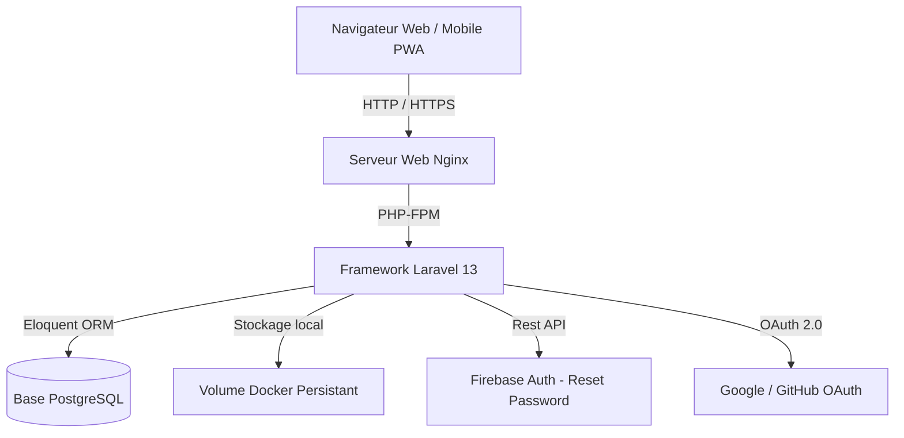

# Rapport Final de Projet — SUPFile

**Module :** Projet de Fin d'Études (PFE)  
**Membres de l'équipe :**
- Étudiant 1 : Ali Badry (Backend & Infrastructure)
- Étudiant 2 : Mahmoud Qzibar (Frontend, Mobile & Documentation)

---

## 1. Introduction et Objectifs du Projet

SUPFile est une application web et mobile responsive (PWA) de stockage et de partage de fichiers inspirée de solutions cloud grand public comme Google Drive ou Dropbox. L'objectif était de concevoir un système complet, sécurisé, rapide et indépendant de frameworks CSS ou JS lourds afin d'offrir les meilleures performances et une accessibilité optimale.

### Objectifs clés :
- **Quota de stockage** : 30 Go d'espace gratuit par utilisateur.
- **Multi-plateforme** : Web de bureau et version mobile (PWA) synchronisés.
- **Indépendance technologique** : Utilisation de Vanilla CSS (sans Tailwind) et de JavaScript pur.
- **Sécurité et Persistance** : Utilisation de Docker, isolation des variables d'environnement (`.env`) et base de données relationnelle.

---

## 2. Architecture Technique et Choix Technologiques

Le projet repose sur une pile technologique moderne, légère et robuste :

### Choix de la pile :
1. **Backend (Laravel 13)** : Permet de gérer rapidement les routes, les contrôleurs, la base de données via l'ORM Eloquent, et les fonctionnalités de stockage.
2. **Base de données (PostgreSQL)** : Assure la cohérence des métadonnées des dossiers, des fichiers, des utilisateurs et des liens de partage.
3. **Frontend (Blade + HTML5 + CSS3 + JS Vanilla)** :
   - Mise en page inspirée de la tendance **"Bento-box"** (cartes compartimentées interactives).
   - Style CSS sur mesure pour un contrôle total de l'apparence et du mode sombre/clair.
   - JavaScript natif pour les fonctionnalités dynamiques (barre de progression d'upload, drag-and-drop, visionneuses).
4. **Authentification Hybride** :
   - Sessions et cookies gérés nativement par Laravel.
   - OAuth 2.0 pour la connexion rapide via Google et GitHub.
   - Intégration de l'API REST de Firebase Auth pour sécuriser la réinitialisation de mot de passe.
5. **Infrastructure (Docker & Docker Compose)** :
   - Conteneurisation complète avec trois services principaux : `web` (Nginx), `app` (PHP-FPM) et `db` (Postgres).
   - Volumes persistants pour la base de données et le stockage local des fichiers (`storage_volume`).

---

## 3. Fonctionnalités Réalisées

### Authentification & Profil
- Inscription et connexion (classique et OAuth Google/GitHub).
- Réinitialisation de mot de passe sécurisée via Firebase Service.
- Page de gestion des paramètres utilisateur (mise à jour du prénom, nom, et e-mail).

### Gestion de Fichiers (File Manager)
- Création dynamique de dossiers avec gestion de l'arborescence (Breadcrumbs).
- Import de fichiers avec barre de progression interactive en JavaScript.
- Téléchargement individuel de fichiers et téléchargement de dossiers entiers compressés au format ZIP.
- Visionneuse intégrée pour les formats PDF, textes brut, et images.
- Système de Corbeille basé sur le mécanisme `SoftDeletes` de Laravel, permettant de restaurer des éléments supprimés par erreur ou de les purger définitivement.

### Partage & Quotas
- Génération de liens de partage publics uniques (`/s/{token}`) accessibles aux invités sans inscription requise.
- Calcul en temps réel de l'espace disque consommé sur le quota global de 30 Go de l'utilisateur.

---

## 4. Organisation du Travail et Branches Git

Pour garantir une collaboration propre, l'équipe a suivi un workflow Git basé sur des fonctionnalités distinctes (`feature branches`) :

- `main` : Branche de production stable.
- `dev` : Branche d'intégration des développements.
- `feature/auth` : Authentification, OAuth et réinitialisation de mot de passe.
- `feature/file-manager` : Gestion des fichiers, dossiers, corbeille et prévisualisation.
- `feature/docs` : Documentation technique, manuel utilisateur et rapport final.

Les commits ont suivi la convention **Conventional Commits** (ex: `feat:`, `docs:`, `fix:`) pour maintenir un historique lisible et professionnel.

---

## 5. Conclusion et Perspectives

Le projet SUPFile répond en tout point aux spécifications initiales. L'utilisation d'une interface responsive / PWA offre une alternative légère et performante à une application mobile native. 

### Perspectives futures :
- Ajout du partage collaboratif direct entre utilisateurs inscrits sur la plateforme.
- Intégration d'un module de chiffrement des fichiers côté client pour une confidentialité renforcée (Zero-Knowledge).
- Extension de la visionneuse pour prendre en charge les formats de documents bureautiques complexes (.docx, .xlsx).
